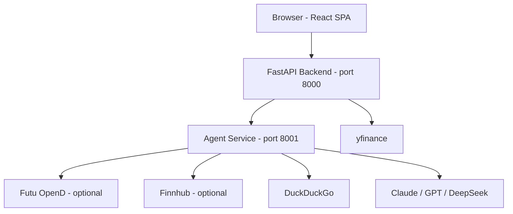
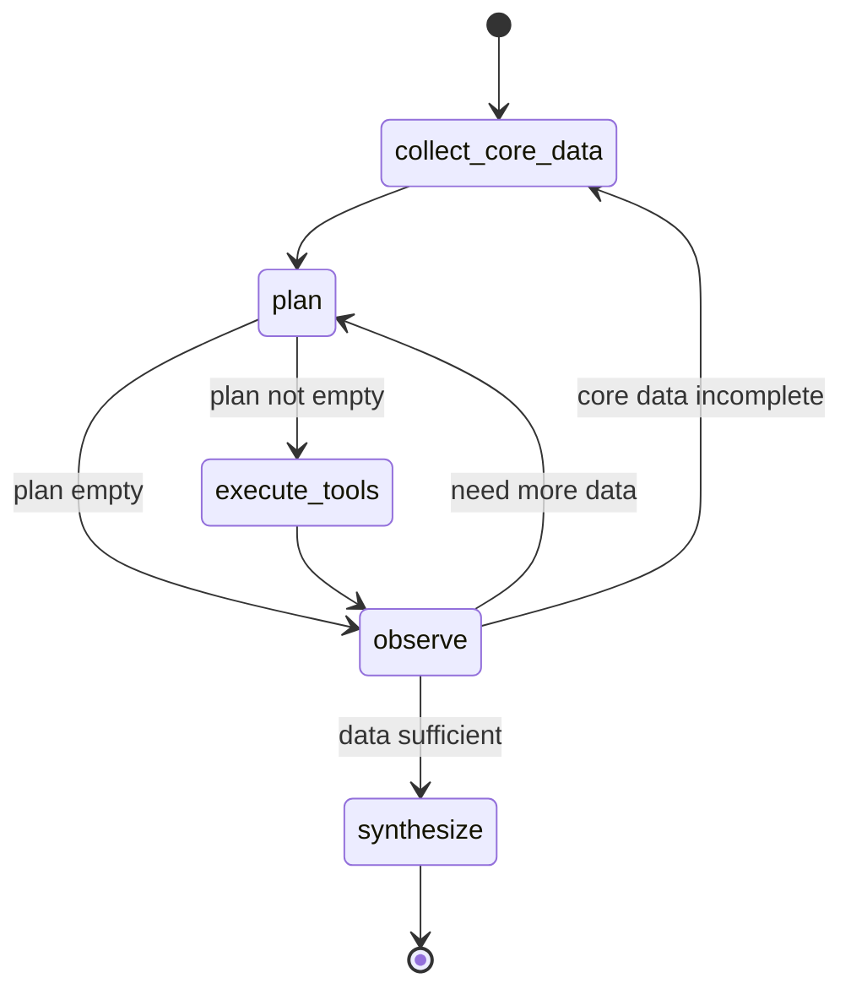

# Asset Analytics Agent

A web application for searching and analyzing financial assets (stocks, ETFs) across all major global markets. Search by ticker, view detailed asset information, and get AI-powered analysis using your own LLM API keys.

Built with Claude Code + DeepSeek V4 Pro.

## Features

- **Global search** — autocomplete across US, HK, CN, JP, UK, KR, TW, EU, and more
- **Asset detail** — interactive price chart, key metrics (P/E, P/B, EPS, dividend yield, beta), company profile with description toggle, recent news widget
- **AI analysis** — multi-step LangGraph agent with live streaming visibility into each stage
- **Three pre-analysis data widgets** — Market Data, Macro Research, Sentiment & News — fetched in parallel and cached for instant loading
- **Real-time market data** — Futu OpenD integration for market snapshots (price, volume, valuation, fundamentals, 52W range), with automatic yfinance fallback
- **News sources** — Finnhub API for ticker-specific financial news, with DuckDuckGo fallback
- **Bloomberg-style analytics** — pre-computed valuation zones, momentum returns, RSI, drawdown, volatility with TTL cache
- **Bilingual UI** — English and Simplified Chinese (zh-CN) with language toggle, covering all UI strings and LLM analysis output
- **Parallel tool execution** — concurrent data fetching via ThreadPoolExecutor
- **Settings** — configure LLM provider, model, API key, and optional Finnhub key (stored locally, never sent to server)

## Architecture



- **Backend:** Python FastAPI — stateless API proxy, fetches market data from yfinance, forwards analyze requests to agent service
- **Agent Service:** Python FastAPI + LangGraph — multi-step reasoning agent with deterministic core data collection, structured field extraction, parallel execution, SSE streaming, and pre-computed analytics
- **Frontend:** React + Vite + TypeScript — SPA with live-streamed analysis, plan reasoning display, i18n (en/zh-CN), and settings
- **Data sources:** yfinance (primary), Futu OpenD (real-time, optional), Finnhub (news, optional), DuckDuckGo (news fallback)

### Agent Graph Flow



**5 nodes, 2 conditional edges:**

| Node | Type | Description |
|------|------|-------------|
| `collect_core_data` | Deterministic | Runs 3 core tools in parallel (market data, macro research, sentiment news). Cache-aware: skips already-collected data. |
| `plan` | LLM | Analyzes available data and plans supplementary tool calls (price history, technicals). Empty plan routes directly to observe. |
| `execute_tools` | Deterministic | Runs planned tools in parallel via ThreadPoolExecutor (max 5). Keys results by call_id for precise step matching. |
| `observe` | Hybrid | Deterministic coverage check first (core data present + healthy?), then LLM qualitative judgment (enough vs. more). |
| `synthesize` | LLM | Computes Bloomberg-style analytics, builds enriched prompt with structured sections, writes final markdown report. |

**Three-tier data classification:**

| Tier | Tools | Type |
|------|-------|------|
| 市场基础数据 | `fetch_market_data` | Structured (price, P/E, P/B, EPS, market cap, sector) |
| 宏观与研报 | `fetch_macro_research` | Unstructured (macro news, sector trends, policy updates) |
| 情绪与舆情 | `fetch_sentiment_news` | Alternative (news articles by category, sentiment) |

## Quick Start

### Prerequisites

- Python 3.11+
- Node.js 18+
- (Optional) [Futu OpenD](https://www.futunn.com/download/OpenD) — for real-time market snapshots
- (Optional) [Finnhub API key](https://finnhub.io/register) — for ticker-specific news

### Install & Run

```bash
# Clone and enter the project
git clone https://github.com/chenhaoyu426/assets_analytics_agent.git
cd assets_analytics_agent

# Backend setup
cd backend
pip install -r requirements.txt

# Agent service setup
cd ../agent-service
pip install -r requirements.txt

# Frontend setup
cd ../frontend
npm install

# Start all three servers
cd ..
./start.sh
```

- Frontend: http://localhost:5173
- Backend API docs: http://localhost:8000/docs
- Agent API docs: http://localhost:8001/docs

### Manual Start

```bash
# Terminal 1 — Backend (run from project root)
uvicorn backend.app.main:app --reload --port 8000

# Terminal 2 — Agent Service
cd agent-service && PYTHONPATH=. uvicorn agent_service.app.main:app --reload --port 8001

# Terminal 3 — Frontend
cd frontend && npm run dev
```

## API Endpoints

| Method | Path | Description |
|--------|------|-------------|
| GET | `/api/health` | Health check |
| GET | `/api/search?q={query}` | Autocomplete search across all markets |
| GET | `/api/assets/{symbol}` | Asset detail: profile, price, metrics, news |
| GET | `/api/assets/{symbol}/price-history?period=1mo` | OHLCV price series (1mo, 6mo, 1y, 5y, max) |
| POST | `/api/analyze/{symbol}` | LLM agent analysis with SSE streaming |
| GET | `/api/market-data/{symbol}` | Structured market data (agent service) |
| GET | `/api/macro-research/{symbol}` | Macro research and sector analysis (agent service) |
| GET | `/api/sentiment-news/{symbol}` | Sentiment news with optional Finnhub key (agent service) |

### POST /api/analyze/{symbol}

Returns a Server-Sent Events (SSE) stream with real-time progress updates.

Request body:

```json
{
  "provider": "claude",
  "model": "claude-sonnet-4-6",
  "api_key": "sk-...",
  "base_url": null,
  "finnhub_api_key": "c...",
  "language": "en",
  "prefetched_data": {
    "fetch_market_data": "...",
    "fetch_macro_research": "...",
    "fetch_sentiment_news": "..."
  }
}
```

SSE event types:

| Event | Description |
|-------|-------------|
| `step_started` | Agent stage began (planning, evaluating, synthesizing) |
| `plan_reasoning` | LLM's reasoning about tool selection |
| `tool_called` | Tool invocation started |
| `tool_result` | Tool returned data summary |
| `report_ready` | Final analysis report (markdown) |
| `error` | Recoverable or non-recoverable error |
| `done` | Stream complete |

### Agent Tools

#### Core (always collected, deterministic)

| Tool | Source | Description |
|------|--------|-------------|
| `fetch_market_data` | Futu → yfinance | Real-time price, P/E, P/B, EPS, market cap, sector, country, 52W range |
| `fetch_macro_research` | DuckDuckGo | Macro news, sector trends, policy updates |
| `fetch_sentiment_news` | Finnhub → yfinance → DuckDuckGo | News articles grouped by category |

#### Supplementary (LLM-planned as needed)

| Tool | Source | Description |
|------|--------|-------------|
| `fetch_price_history` | yfinance | OHLCV historical price series (1mo/6mo/1y/5y/max) |
| `calculate_technicals` | computed | SMA, EMA, RSI, volatility, trend from price data |

**Fallback chain:** Each tool has primary → secondary → tertiary sources. `fetch_market_data` tries Futu first, falls back to yfinance. `fetch_sentiment_news` tries Finnhub, then yfinance, then DuckDuckGo.

## Project Structure

```
assets_analytics_agent/
├── backend/                              # Python FastAPI (proxy layer)
│   ├── app/
│   │   ├── main.py                       # app entry point (port 8000)
│   │   ├── models/                       # Pydantic schemas
│   │   │   └── schemas.py
│   │   ├── activities/                   # one file per endpoint
│   │   │   ├── search.py                 # GET /api/search
│   │   │   ├── asset_detail.py           # GET /api/assets/{symbol}
│   │   │   ├── price_history.py          # GET /api/assets/{symbol}/price-history
│   │   │   └── analyze.py                # POST /api/analyze/{symbol} (SSE proxy)
│   │   └── proxy/                        # external adapters
│   │       ├── yfinance.py               # market data + search + news
│   │       └── llm.py                    # Claude / GPT / DeepSeek routing
│   └── requirements.txt
├── agent-service/                        # Python FastAPI + LangGraph agent
│   ├── agent_service/app/
│   │   ├── main.py                       # entry point (port 8001)
│   │   ├── agent_router.py               # SSE streaming + pre-fetched data widgets
│   │   ├── graph.py                      # StateGraph + all 5 nodes + routing
│   │   ├── prompts.py                    # LLM prompts + tool registry + i18n
│   │   ├── events.py                     # SSE event formatters
│   │   ├── state.py                      # AgentState TypedDict + subtypes
│   │   ├── cache.py                      # TTL in-memory analytics cache
│   │   ├── analytics/                    # Bloomberg-style derived metrics
│   │   │   └── metrics.py
│   │   ├── tools/                        # LangChain tools
│   │   │   ├── market_data.py            # fetch_market_data (Futu → yfinance)
│   │   │   ├── macro_research.py         # fetch_macro_research (web search)
│   │   │   ├── sentiment_news.py         # fetch_sentiment_news (Finnhub → yfinance → DDG)
│   │   │   ├── yfinance_tools.py         # fetch_price_history
│   │   │   ├── technicals.py             # calculate_technicals
│   │   │   ├── futu_data.py              # Futu OpenD client
│   │   │   ├── finnhub_news.py           # Finnhub API client
│   │   │   └── news_search.py            # DuckDuckGo web search
│   │   └── llm/                          # LLM client factory
│   │       └── client_factory.py
│   ├── tests/
│   │   └── test_graph.py                 # 30 unit tests for graph, routing, extraction
│   └── requirements.txt
├── frontend/                             # React + Vite + TypeScript
│   ├── src/
│   │   ├── components/                   # SearchBar, AssetDetail, PriceChart,
│   │   │                                 # NewsList, AnalyzePanel, SettingsDialog,
│   │   │                                 # LanguageToggle
│   │   ├── pages/                        # SearchPage, AssetPage
│   │   ├── i18n/                         # translations.ts, LocaleContext.tsx
│   │   ├── api/                          # API client + types
│   │   └── App.tsx                       # routing + providers
│   └── vite.config.ts
├── tests/                                # Python backend tests
├── docs/superpowers/                     # design specs, plans, tasks
├── features/                             # completed feature records
├── start.sh                              # start all three servers
└── README.md
```

## Usage

1. Open http://localhost:5173
2. Search for a ticker (e.g. `AAPL`, `0700.HK`, `300502.SZ`, `7203.T`)
3. Click a result to see detailed information — three data widgets load in parallel
4. Click **LLM Settings** to configure your LLM provider, API key, and optional Finnhub key
5. Click **Analyze with AI** to watch the agent reason through a multi-step analysis in real time
6. Toggle **EN/中文** in the navbar to switch languages

Your API keys are stored in your browser's localStorage and sent directly to the backend per request. They are never stored on the server.

## Development

### Run Tests

```bash
# Backend tests
cd backend && python3 -m pytest tests/ -v

# Agent service tests (30 unit tests)
cd agent-service && PYTHONPATH=. python3 -m pytest tests/test_graph.py -v

# Frontend type check
cd frontend && npx tsc --noEmit
```

### Design Documents

See `docs/superpowers/` for the full design spec, implementation plan, and task breakdown. See `features/` for completed feature records with changed files and commits.

### Conventions

- `activities/` — one file per API endpoint, handles request/response only
- `proxy/` — adapters for all external dependencies (yfinance, LLM providers)
- `tools/` — one file per LangChain agent tool
- `models/` — shared Pydantic schemas consumed by both activities and proxy
- `analytics/` — pre-computed metrics independent of LLM
- No server-side API key storage — keys are passed per request
- No local search index — yfinance provides autocomplete

## License

MIT © 2026 chenhaoyu426
